# Ajuste event-driven — Periódico Digital Premium

## Decisiones corregidas

1. El periodista crea, edita y envía/publica noticias según permisos.
2. La publicidad no la publica el periodista; la gestiona el editor comercial o administrador.
3. Una noticia pública puede ser vista por visitantes, registrados y premium.
4. Una noticia pública puede mostrar publicidad discreta.
5. Una noticia premium solo puede ser vista completa por usuarios logueados con suscripción activa.
6. Una noticia premium no debe mostrar publicidad: cero ad slots, cero impresiones y cero renderizado de anuncios.
7. Para comentar o reaccionar, siempre se requiere usuario logueado.
8. Al publicar una noticia, el backend emite eventos de dominio.
9. Las notificaciones se generan de forma asíncrona mediante workers.
10. Si la noticia es pública, se notifica a usuarios registrados activos, sean premium o no.
11. Si la noticia es premium, se notifica solo a usuarios con suscripción activa.
12. El sistema debe usar patrón outbox/inbox para no perder eventos críticos.

## Sección recomendada para reemplazar/agregar al SYSTEM INFO

### Arquitectura event-driven obligatoria

El sistema debe diseñarse bajo una arquitectura event-driven para desacoplar la operación editorial de procesos secundarios como notificaciones, indexación, cache, analítica y publicidad. La publicación de un artículo no debe depender de que todos esos procesos terminen en la misma solicitud HTTP.

Cuando un artículo se publica, el CMS debe guardar el cambio de estado dentro de una transacción de base de datos y, en la misma transacción, registrar un evento en la tabla `event_outbox`. Un worker debe leer ese evento y publicarlo al bus de eventos o cola. Los consumidores deben procesarlo de forma idempotente usando `event_inbox`.

Eventos principales:

- `ArticleDraftCreated`
- `ArticleSubmittedForReview`
- `ArticleApproved`
- `ArticlePublished`
- `ArticleUnpublished`
- `ArticleUpdatedAfterPublication`
- `PublicArticlePublished`
- `PremiumArticlePublished`
- `PublicAdSlotsEnabled`
- `PremiumAdSlotsDisabled`
- `NotificationAudienceResolved`
- `NotificationBatchCreated`
- `NotificationSent`
- `NotificationFailed`
- `UserRegistered`
- `SubscriptionPaymentStarted`
- `SubscriptionActivated`
- `SubscriptionExpired`
- `SubscriptionCancelled`
- `ArticleViewed`
- `PremiumArticleAccessDenied`
- `CommentCreated`
- `ReactionCreated`

Reglas event-driven:

- `ArticlePublished` es el evento base de publicación.
- Si `article.accessType = PUBLIC`, se genera `PublicArticlePublished`.
- Si `article.accessType = PREMIUM`, se genera `PremiumArticlePublished`.
- Si la noticia es pública, el worker de publicidad habilita espacios discretos.
- Si la noticia es premium, el worker de publicidad debe emitir `PremiumAdSlotsDisabled` y no debe crear impresiones publicitarias.
- Si la noticia es pública, el worker de audiencia notifica a usuarios registrados activos, incluyendo usuarios premium.
- Si la noticia es premium, el worker de audiencia notifica solo a usuarios con suscripción activa.
- La publicación debe quedar disponible aunque fallen notificaciones, analítica, indexación o publicidad.
- Todo consumidor debe ser idempotente.
- Todo evento crítico debe tener `correlationId`, `causationId`, `aggregateId`, `eventType`, `payload`, `occurredAt` y `publishedAt`.

### Regla actualizada sobre publicidad premium

El contenido premium debe tener experiencia de lectura sin publicidad. Esto implica:

- No renderizar anuncios dentro de notas premium.
- No solicitar anuncios desde el frontend en páginas premium.
- No insertar registros en `advertisement_impressions` para artículos premium.
- No crear espacios publicitarios elegibles para artículos premium.
- No mostrar banners, laterales, bloques inferiores, popups ni anuncios embebidos en notas premium.

La publicidad solo aplica a contenido público.

## Diagrama de clases event-driven

```plantuml
@startuml
title Diagrama de clases event-driven - Periódico digital premium

left to right direction
skinparam classAttributeIconSize 0
skinparam packageStyle rectangle

package "Usuarios y suscripciones" {
  class User {
    +id: UUID
    +fullName: string
    +email: string
    +passwordHash: string
    +status: string
    +createdAt: datetime
    +updatedAt: datetime
  }

  class Role {
    +id: UUID
    +name: string
    +description: string
  }

  class UserRole {
    +id: UUID
    +userId: UUID
    +roleId: UUID
  }

  class SubscriptionPlan {
    +id: UUID
    +name: string
    +price: decimal
    +currency: string
    +durationDays: int
    +isActive: boolean
  }

  class Subscription {
    +id: UUID
    +userId: UUID
    +planId: UUID
    +status: string
    +startsAt: datetime
    +endsAt: datetime
    +cancelledAt: datetime
    +isActive(now): boolean
  }

  class PaymentTransaction {
    +id: UUID
    +subscriptionId: UUID
    +provider: string
    +externalReference: string
    +amount: decimal
    +status: string
    +paidAt: datetime
  }
}

package "Contenido editorial" {
  class Article {
    +id: UUID
    +authorId: UUID
    +categoryId: UUID
    +title: string
    +slug: string
    +summary: string
    +body: text
    +audioTranscript: text
    +articleType: string
    +accessType: string
    +status: string
    +commentsEnabled: boolean
    +reactionsEnabled: boolean
    +publishedAt: datetime
    +createdAt: datetime
    +updatedAt: datetime
  }

  class ArticleRevision {
    +id: UUID
    +articleId: UUID
    +editedByUserId: UUID
    +titleSnapshot: string
    +bodySnapshot: text
    +changeReason: string
    +createdAt: datetime
  }

  class Category {
    +id: UUID
    +name: string
    +slug: string
    +isActive: boolean
  }

  class Tag {
    +id: UUID
    +name: string
    +slug: string
  }

  class ArticleTag {
    +id: UUID
    +articleId: UUID
    +tagId: UUID
  }

  class MediaAsset {
    +id: UUID
    +uploadedByUserId: UUID
    +mediaType: string
    +url: string
    +caption: string
    +altText: string
    +mimeType: string
    +sizeBytes: long
  }

  class ArticleMedia {
    +id: UUID
    +articleId: UUID
    +mediaAssetId: UUID
    +displayOrder: int
    +isCover: boolean
  }
}

package "Interacción" {
  class Comment {
    +id: UUID
    +articleId: UUID
    +userId: UUID
    +parentCommentId: UUID
    +content: text
    +status: string
    +createdAt: datetime
  }

  class Reaction {
    +id: UUID
    +articleId: UUID
    +userId: UUID
    +reactionType: string
    +createdAt: datetime
  }
}

package "Publicidad" {
  class AdvertisementPlacement {
    +id: UUID
    +code: string
    +name: string
    +allowedContext: string
    +isActive: boolean
  }

  class Advertisement {
    +id: UUID
    +placementId: UUID
    +title: string
    +imageUrl: string
    +targetUrl: string
    +status: string
    +startsAt: datetime
    +endsAt: datetime
  }

  class AdvertisementImpression {
    +id: UUID
    +advertisementId: UUID
    +articleId: UUID
    +userId: UUID
    +renderedAt: datetime
  }
}

package "Event-driven core" {
  class EventOutbox {
    +id: UUID
    +aggregateType: string
    +aggregateId: UUID
    +eventType: string
    +payload: json
    +correlationId: UUID
    +causationId: UUID
    +status: string
    +occurredAt: datetime
    +publishedAt: datetime
    +retryCount: int
  }

  class EventInbox {
    +id: UUID
    +consumerName: string
    +eventId: UUID
    +eventType: string
    +processedAt: datetime
    +status: string
    +errorMessage: text
  }

  class NotificationBatch {
    +id: UUID
    +sourceEventId: UUID
    +articleId: UUID
    +audienceType: string
    +status: string
    +createdAt: datetime
  }

  class Notification {
    +id: UUID
    +batchId: UUID
    +userId: UUID
    +articleId: UUID
    +channel: string
    +title: string
    +message: string
    +status: string
    +sentAt: datetime
    +readAt: datetime
  }

  class UserNotificationPreference {
    +id: UUID
    +userId: UUID
    +channel: string
    +enabled: boolean
    +premiumAlertsEnabled: boolean
    +publicNewsAlertsEnabled: boolean
  }
}

User "1" -- "0..*" UserRole
Role "1" -- "0..*" UserRole
User "1" -- "0..*" Subscription
SubscriptionPlan "1" -- "0..*" Subscription
Subscription "1" -- "0..*" PaymentTransaction

User "1" -- "0..*" Article : author
Category "1" -- "0..*" Article
Article "1" -- "0..*" ArticleRevision
Article "1" -- "0..*" ArticleTag
Tag "1" -- "0..*" ArticleTag
Article "1" -- "0..*" ArticleMedia
MediaAsset "1" -- "0..*" ArticleMedia

Article "1" -- "0..*" Comment
User "1" -- "0..*" Comment
Article "1" -- "0..*" Reaction
User "1" -- "0..*" Reaction

AdvertisementPlacement "1" -- "0..*" Advertisement
Advertisement "1" -- "0..*" AdvertisementImpression
Article "1" -- "0..*" AdvertisementImpression
User "0..1" -- "0..*" AdvertisementImpression

EventOutbox "1" -- "0..*" EventInbox : consumed by
EventOutbox "1" -- "0..*" NotificationBatch : source event
NotificationBatch "1" -- "0..*" Notification
User "1" -- "0..*" Notification
Article "1" -- "0..*" Notification
User "1" -- "0..*" UserNotificationPreference

note right of Article
accessType = PUBLIC:
- Visible para visitantes.
- Puede mostrar publicidad discreta.
- Notificación a usuarios registrados activos.

accessType = PREMIUM:
- Requiere login + suscripción activa.
- Cero publicidad.
- Notificación solo a premium activos.
end note

note bottom of EventOutbox
Patrón outbox:
los eventos se guardan en la misma transacción
que el cambio del agregado.
Evita publicar artículo sin evento o evento sin artículo.
end note

note bottom of AdvertisementImpression
Constraint de negocio:
No registrar impresiones si
Article.accessType = PREMIUM.
end note

@enduml
```

## Diagrama relacional event-driven

```plantuml
@startuml
title Diagrama relacional event-driven - Periódico digital premium

left to right direction
skinparam linetype ortho
skinparam packageStyle rectangle

entity "users" as users {
  * id : uuid <<PK>>
  --
  full_name : varchar
  email : varchar <<UNIQUE>>
  password_hash : varchar
  status : varchar
  created_at : timestamp
  updated_at : timestamp
}

entity "roles" as roles {
  * id : uuid <<PK>>
  --
  name : varchar <<UNIQUE>>
  description : varchar
}

entity "user_roles" as user_roles {
  * id : uuid <<PK>>
  --
  user_id : uuid <<FK>>
  role_id : uuid <<FK>>
}

entity "subscription_plans" as subscription_plans {
  * id : uuid <<PK>>
  --
  name : varchar
  price : decimal
  currency : varchar
  duration_days : int
  is_active : boolean
}

entity "subscriptions" as subscriptions {
  * id : uuid <<PK>>
  --
  user_id : uuid <<FK>>
  plan_id : uuid <<FK>>
  status : varchar
  starts_at : timestamp
  ends_at : timestamp
  cancelled_at : timestamp
}

entity "payment_transactions" as payment_transactions {
  * id : uuid <<PK>>
  --
  subscription_id : uuid <<FK>>
  provider : varchar
  external_reference : varchar
  amount : decimal
  currency : varchar
  status : varchar
  paid_at : timestamp
  created_at : timestamp
}

entity "categories" as categories {
  * id : uuid <<PK>>
  --
  name : varchar
  slug : varchar <<UNIQUE>>
  is_active : boolean
}

entity "articles" as articles {
  * id : uuid <<PK>>
  --
  author_id : uuid <<FK>>
  category_id : uuid <<FK>>
  title : varchar
  slug : varchar <<UNIQUE>>
  summary : text
  body : text
  audio_transcript : text
  article_type : varchar
  access_type : varchar
  status : varchar
  comments_enabled : boolean
  reactions_enabled : boolean
  published_at : timestamp
  created_at : timestamp
  updated_at : timestamp
}

entity "article_revisions" as article_revisions {
  * id : uuid <<PK>>
  --
  article_id : uuid <<FK>>
  edited_by_user_id : uuid <<FK>>
  title_snapshot : varchar
  body_snapshot : text
  change_reason : text
  created_at : timestamp
}

entity "tags" as tags {
  * id : uuid <<PK>>
  --
  name : varchar
  slug : varchar <<UNIQUE>>
}

entity "article_tags" as article_tags {
  * id : uuid <<PK>>
  --
  article_id : uuid <<FK>>
  tag_id : uuid <<FK>>
}

entity "media_assets" as media_assets {
  * id : uuid <<PK>>
  --
  uploaded_by_user_id : uuid <<FK>>
  media_type : varchar
  url : text
  caption : varchar
  alt_text : varchar
  mime_type : varchar
  size_bytes : bigint
}

entity "article_media" as article_media {
  * id : uuid <<PK>>
  --
  article_id : uuid <<FK>>
  media_asset_id : uuid <<FK>>
  display_order : int
  is_cover : boolean
}

entity "comments" as comments {
  * id : uuid <<PK>>
  --
  article_id : uuid <<FK>>
  user_id : uuid <<FK>>
  parent_comment_id : uuid <<FK nullable>>
  content : text
  status : varchar
  created_at : timestamp
  updated_at : timestamp
}

entity "reactions" as reactions {
  * id : uuid <<PK>>
  --
  article_id : uuid <<FK>>
  user_id : uuid <<FK>>
  reaction_type : varchar
  created_at : timestamp
}

entity "advertisement_placements" as advertisement_placements {
  * id : uuid <<PK>>
  --
  code : varchar <<UNIQUE>>
  name : varchar
  allowed_context : varchar
  is_active : boolean
}

entity "advertisements" as advertisements {
  * id : uuid <<PK>>
  --
  placement_id : uuid <<FK>>
  title : varchar
  image_url : text
  target_url : text
  status : varchar
  starts_at : timestamp
  ends_at : timestamp
}

entity "advertisement_impressions" as advertisement_impressions {
  * id : uuid <<PK>>
  --
  advertisement_id : uuid <<FK>>
  article_id : uuid <<FK>>
  user_id : uuid <<FK nullable>>
  rendered_at : timestamp
}

entity "event_outbox" as event_outbox {
  * id : uuid <<PK>>
  --
  aggregate_type : varchar
  aggregate_id : uuid
  event_type : varchar
  payload : jsonb
  correlation_id : uuid
  causation_id : uuid
  status : varchar
  occurred_at : timestamp
  published_at : timestamp
  retry_count : int
  last_error : text
}

entity "event_inbox" as event_inbox {
  * id : uuid <<PK>>
  --
  consumer_name : varchar
  event_id : uuid <<FK>>
  event_type : varchar
  status : varchar
  processed_at : timestamp
  error_message : text
}

entity "notification_batches" as notification_batches {
  * id : uuid <<PK>>
  --
  source_event_id : uuid <<FK>>
  article_id : uuid <<FK>>
  audience_type : varchar
  status : varchar
  created_at : timestamp
}

entity "notifications" as notifications {
  * id : uuid <<PK>>
  --
  batch_id : uuid <<FK>>
  user_id : uuid <<FK>>
  article_id : uuid <<FK>>
  channel : varchar
  title : varchar
  message : text
  status : varchar
  sent_at : timestamp
  read_at : timestamp
  failure_reason : text
}

entity "user_notification_preferences" as user_notification_preferences {
  * id : uuid <<PK>>
  --
  user_id : uuid <<FK>>
  channel : varchar
  enabled : boolean
  public_news_alerts_enabled : boolean
  premium_alerts_enabled : boolean
}

users ||--o{ user_roles
roles ||--o{ user_roles
users ||--o{ subscriptions
subscription_plans ||--o{ subscriptions
subscriptions ||--o{ payment_transactions
users ||--o{ articles
categories ||--o{ articles
articles ||--o{ article_revisions
users ||--o{ article_revisions
articles ||--o{ article_tags
tags ||--o{ article_tags
users ||--o{ media_assets
articles ||--o{ article_media
media_assets ||--o{ article_media
articles ||--o{ comments
users ||--o{ comments
comments ||--o{ comments
articles ||--o{ reactions
users ||--o{ reactions
advertisement_placements ||--o{ advertisements
advertisements ||--o{ advertisement_impressions
articles ||--o{ advertisement_impressions
users ||--o{ advertisement_impressions
event_outbox ||--o{ event_inbox
event_outbox ||--o{ notification_batches
articles ||--o{ notification_batches
notification_batches ||--o{ notifications
users ||--o{ notifications
articles ||--o{ notifications
users ||--o{ user_notification_preferences

note right of event_outbox
Eventos importantes:
- ArticlePublished
- PublicArticlePublished
- PremiumArticlePublished
- NotificationBatchCreated
- SubscriptionActivated
- CommentCreated
- ReactionCreated
end note

note bottom of notifications
Si article.access_type = PUBLIC:
audience_type = REGISTERED_USERS

Si article.access_type = PREMIUM:
audience_type = ACTIVE_PREMIUM_USERS
end note

note bottom of advertisement_impressions
Regla fuerte:
No registrar impresiones publicitarias
para articles.access_type = PREMIUM.
end note

note bottom of reactions
UNIQUE(article_id, user_id)
para evitar duplicados.
end note

@enduml
```

